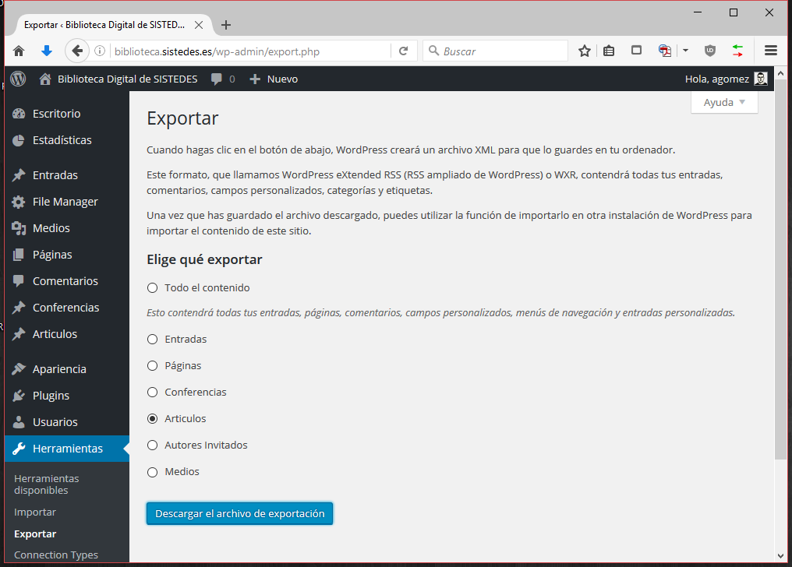

# Sistedes Digital Library Tools

Tools for the Sistedes digital library.

## es.sistedes.handle.generator

Generates a list of handle value lines to register the handles for the wordpress entries in the [Sistedes Digital Library](http://biblioteca.sistedes.es).

### Downloads

Find the releases at https://github.com/abelgomez/sistedes.biblioteca/releases

To run the tool, only the `generator.jar` file is needed. 

### Command line options:

```
usage: java -jar <this-file.jar> -p <prefix> [-i <input file>] [-o <output file>] [-g] [-d]
 -p,--prefix <prefix>        Handle server's prefix (mandatory)
 -i,--input <input file>     The input file (optional, stdin will be used if no input file is specified)
 -o,--output <output file>   The output file (optional, stdout will be used if no input file is specified)
 -g,--guid                   Use the guid tag instead of the link
 -d,--add-delete             Add delete statements before the creation
 -f,--filter <filter>        Regular expression that the handles of the elements to be transformed must match
```

### How to use this tool

1. Step 1: Export the wordpress articles using the administrator GUI:



1. Step 2: Launch the generator:

```
$ java -jar generator.jar -p 11705 -i export.xml -o result.txt

$ cat result.txt
CREATE 11705/JISBD/2015/009
100 HS_ADMIN 86400 1110 ADMIN 300:111111111111:0.NA/11705
1 URL 86400 1110 UTF8 http://biblioteca.sistedes.es/articulo/un-indice-espacio-temporal-compacto-para-consultas-time-slice-y-time-interval/

```

  It is also possible to run the command without the `-i` and `-o` arguments, and stdin and stdout will be used instead. This feature is specially useful when using the tool within shell scripts:
  
```
$ cat export.xml | java -jar generator.jar -p 11705
CREATE 11705/JISBD/2015/009
100 HS_ADMIN 86400 1110 ADMIN 300:111111111111:0.NA/11705
1 URL 86400 1110 UTF8 http://biblioteca.sistedes.es/articulo/un-indice-espacio-temporal-compacto-para-consultas-time-slice-y-time-interval/

```

  An example using the regular expression filters could be:

```
$ java -jar generator.jar -p 11705 -i export.xml -f this-filter-does-not-match-anything

$ java -jar generator.jar -p 11705 -i export.xml -f 11705/JISBD/.*
CREATE 11705/JISBD/2015/009
100 HS_ADMIN 86400 1110 ADMIN 300:111111111111:0.NA/11705
1 URL 86400 1110 UTF8 http://biblioteca.sistedes.es/articulo/un-indice-espacio-temporal-compacto-para-consultas-time-slice-y-time-interval/

```
